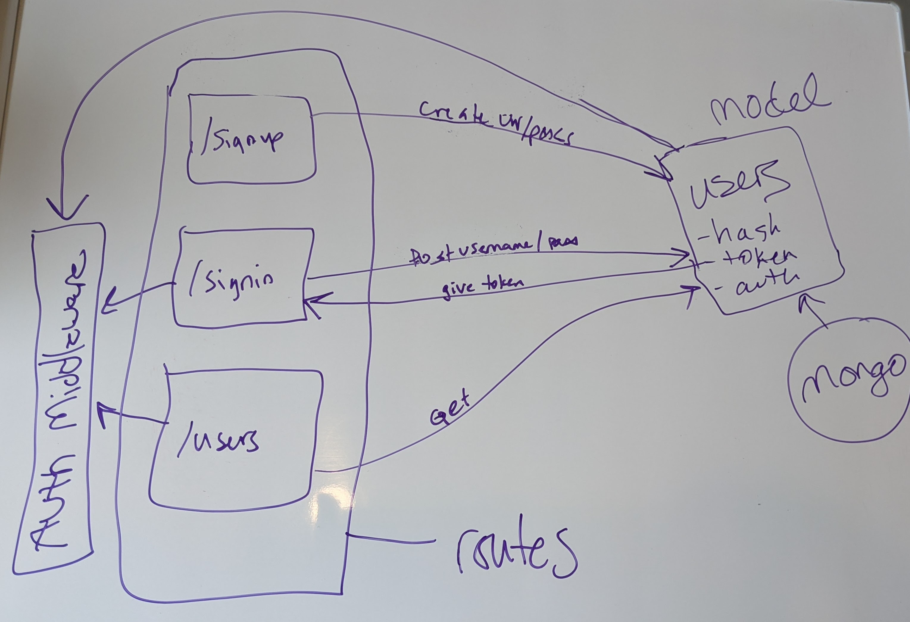
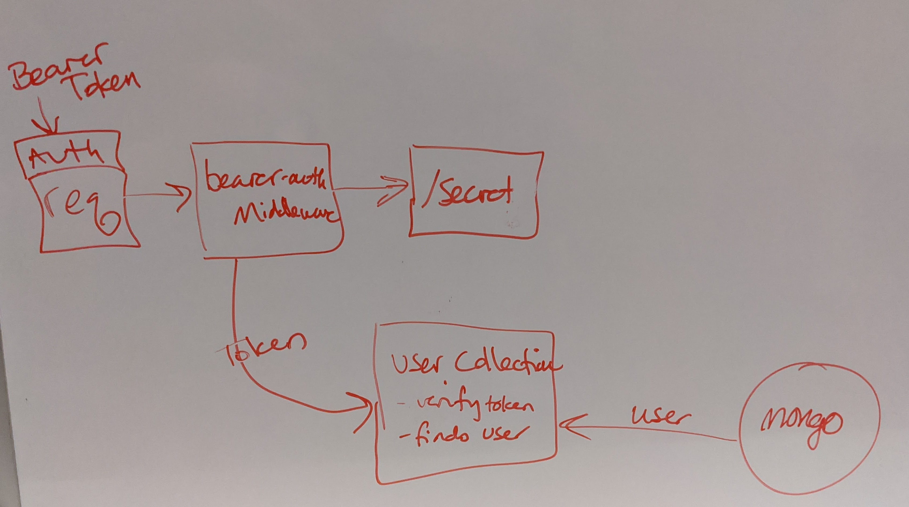

# LAB 11 - 14 | Code Fellows 401

## Project: API Server

#### Author: Tif Taylor | Date: October 2020

### Links & Resources
- HTTP Testing Service | [Swagger](inspector.swagger.io)

### Setup
#### `.env` requirements
- PORT
- MONGODB_URI
- JWT_SECRET

#### `package.json` requirements
- `npm install`
  - [express](https://expressjs.com/)
  - [dotenv](https://www.npmjs.com/package/dotenv)
  - [base-64](https://www.npmjs.com/package/base-64)
  - [bcrypt](https://www.npmjs.com/package/bcrypt)
  - [jsonwebtoken](https://www.npmjs.com/package/jsonwebtoken)

#### Running the app
- `npm start`

#### Tests
- Unit Tests: `npm test`
- `npm install`
  - [jest](https://jestjs.io/)
  - [supertest](https://www.npmjs.com/package/supertest)

### UML for Lab11 thru Lab 14
**Lab 11 | Basic Auth**

**Lab 12 | Bearer Auth**

**Lab 13**

**Lab 14**

### Resources: 
- For dealing with _id I used this tip from [StackOverflow](https://stackoverflow.com/questions/7034848/mongodb-output-id-instead-of-id)